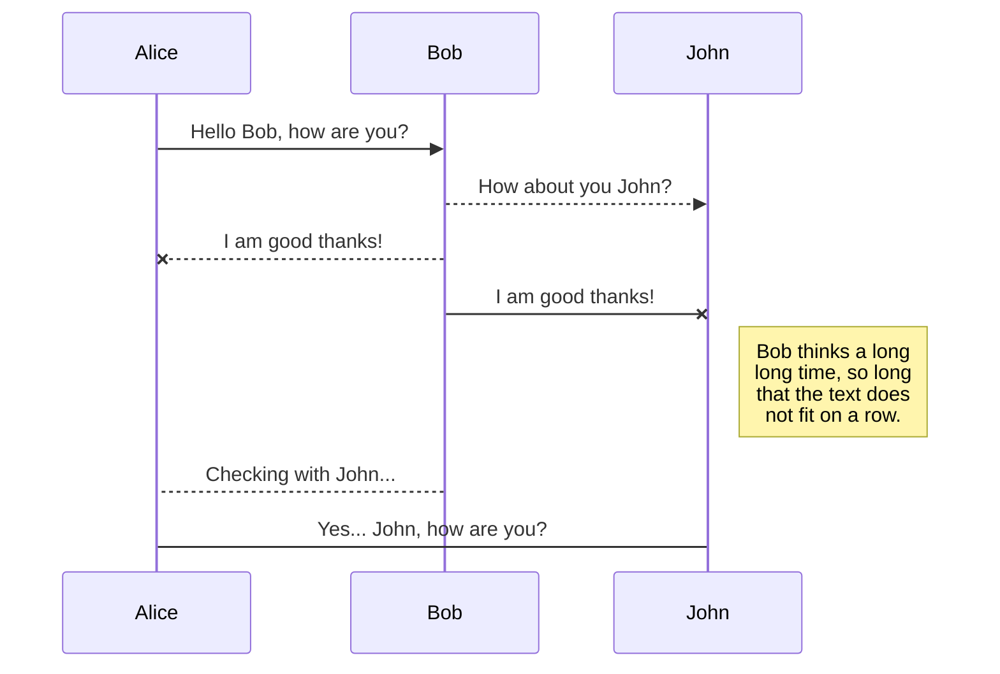

# ¡Bienvenido al proyecto Yape kafka!

Este es un ejemplo sencillo y muy básico que utiliza sockets y kafka.

## Pre-requisitos

- Descargar kafka (zookeeper)
- Correr kafka (zookeeper)
- Crear topic llamado test

## Instalación Kafka

```sh
cd kafka-folder
bin/zookeeper-server-start.sh config/zookeeper.properties
bin/kafka-server-start.sh config/server.properties
bin/kafka-topics.sh --create --topic test --bootstrap-server localhost:9092
```

## Instalación proyecto

```sh
cd app-kafka
npm i
node service.js
correr con live server el app.html
```

## hola



